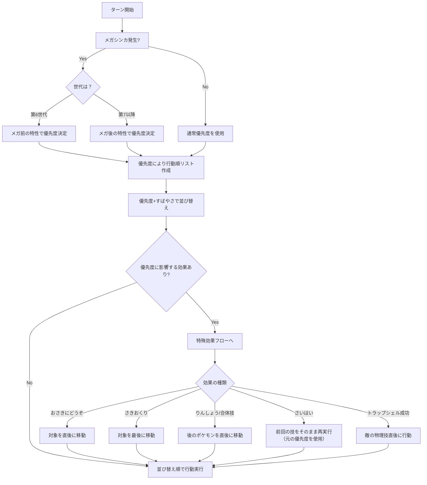

# ポケモン戦闘における「優先度」仕様書

## 優先度決定(通常フロー)

## 優先度決定(特例)

### メガシンカ時

- 第6世代；メガシンカ前の特性が優先度に影響
- 第7世代以降；メガシンカ後の特性が即座に反映

### アンコール時

- 優先度は「そのターンの技」で固定される
- アンコールされる前に選んでいた技の優先度が一部反映されるケースあり

### 特殊効果による行動への影響

| 効果          | 行動順への影響       |
|-------------|---------------|
| おさきにどうぞ     | 対象が即座に行動      |
| さきおくり       | 対象が行動順最後に     |
| りんしょう / 合体技 | 味方の後に即行動      |
| トラップシェル成功   | 敵の攻撃直後に行動     |
| さいはい        | 技の優先度を使用して再行動 |

### 優先度に関係のない行動順変化

- せんせいのツメ／クイックドロウ／イバンのみ：行動順が早くなるが優先度変化なし
- こうこうのしっぽ／まんぷくおこう／あとだし／きんしのちから：行動順が遅くなるが優先度変化なし
- じょうおうのいげん／ファストガード／サイコフィールド：優先度+1以上でなければ無効化されない